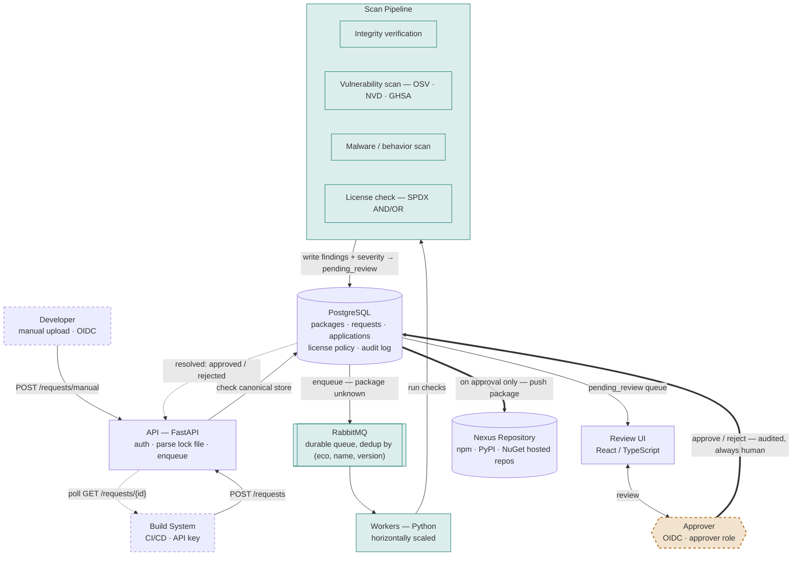
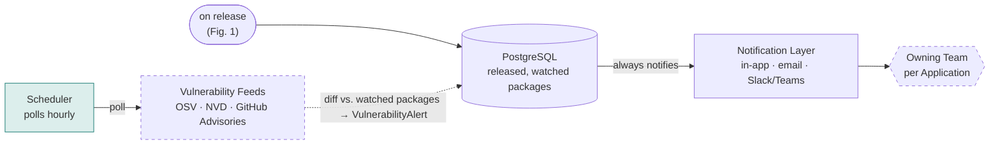

# Airlock — Architecture

Every package a build depends on is resolved against a canonical store,
scanned by a horizontally-scaled worker pool behind RabbitMQ, and — with one
deliberate exception — always signed off by a human before it's trusted. A
second, independent loop keeps released packages under ongoing watch after
they ship. Full detail in `spec.md`; schema in `data-model.md`.

## Fig. 1 — The Request Pipeline

A clean scan never auto-approves — the one exception is a `banned` license,
which auto-rejects before reaching a human at all. Everything else, however
low-risk, waits for the Approver. Rejection is permanent for that exact
(package, version); the only way back in is a new version.

## Fig. 2 — The Watch List

*Independent of Fig. 1 — runs on its own schedule.*

A hit never auto-revokes — that stays a manual action, same as everywhere
else an Approver makes the call. Retiring an `ApplicationVersion` removes
its `watch_list_entries` unless the package is still shared with another
active version.
