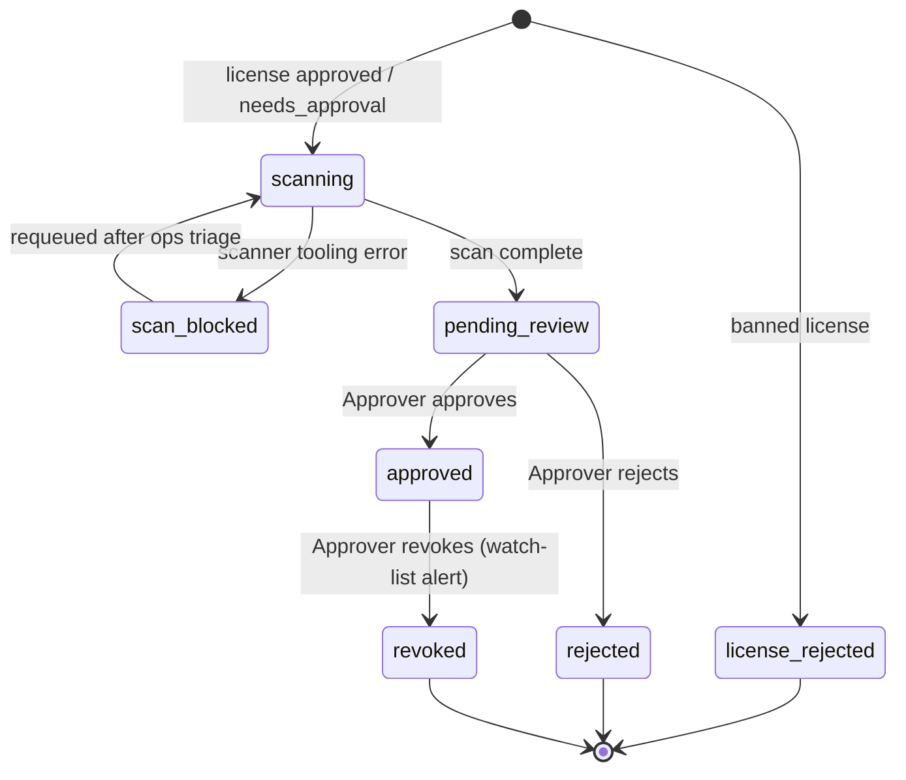
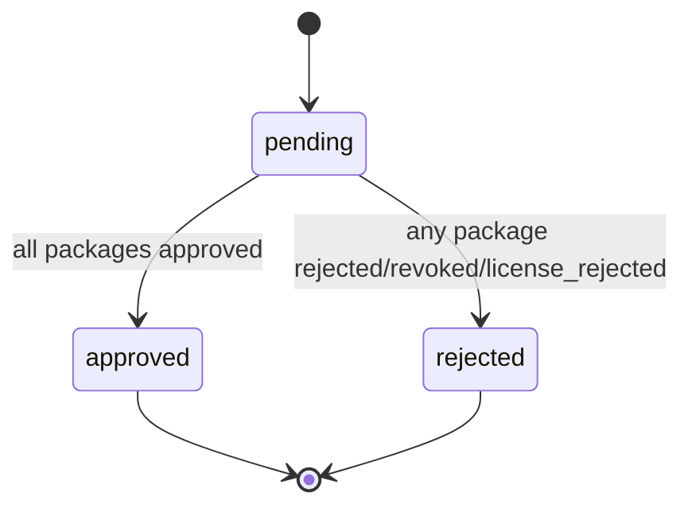
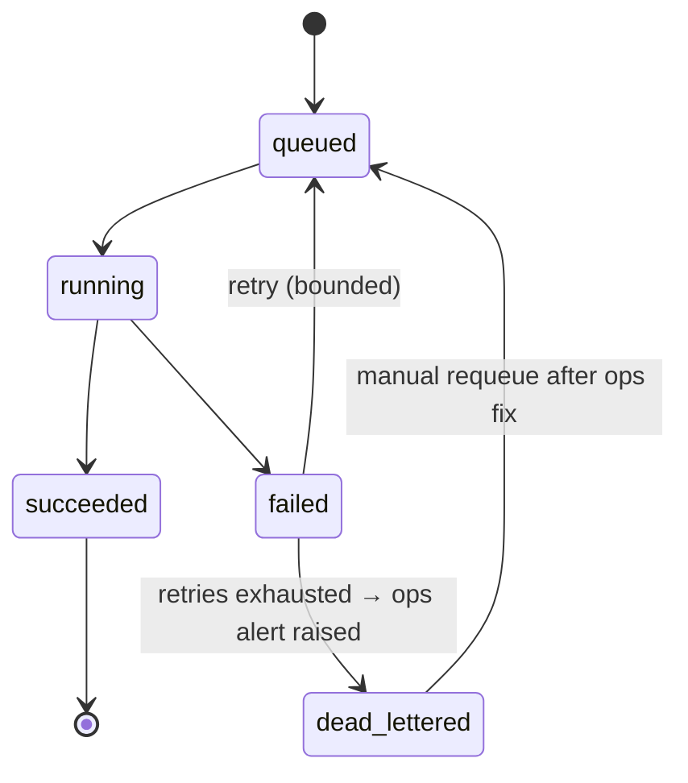
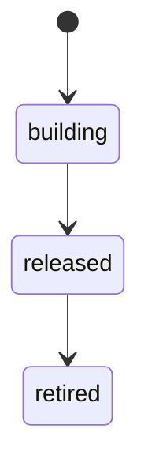
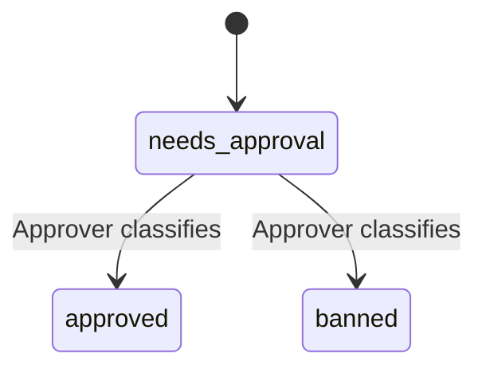

# Airlock — Package Approval Gateway

## 1. Purpose

Airlock is a manual/automated approval gateway that sits between build systems
(and developers) and public package registries. Its job is to stop
supply-chain attacks — compromised or malicious package versions published
under a trusted name (e.g. the Shai-Hulud npm worm) — from entering the
organization's builds unreviewed.

Every package a build depends on, direct or transitive, must pass through
Airlock before it is trusted. Once approved, a package is reusable across
future requests without re-scanning; once released as part of an application
version, its packages are watched on an ongoing basis for newly disclosed
vulnerabilities.

## 2. Actors

- **Build system** — CI/CD pipeline. Submits a package request via API tied to
  an application build version, then polls for resolution.
- **Developer** — submits a lock file manually (e.g. to pre-clear packages
  before wiring up CI, or to check a dependency ad hoc). Not tied to an
  application version.
- **Approver** — a role-gated human reviewer who makes manual approve/reject
  decisions on packages that don't auto-resolve, and reacts to watch-list
  vulnerability alerts.
- **System** — the scan pipeline (integrity, vulnerability, malware/behavior
  scanning, scoring) and the watch-list monitor.

## 3. Core Entities

| Entity | Description |
|---|---|
| **PackageRequest** | One submission (build-system or manual). Holds a set of requested (ecosystem, name, version) tuples, an optional `application_version_id`, and an overall status. |
| **RequestedPackage** | A single (ecosystem, name, version) line item within a request, with its own resolution status and a link to the scan job that resolved it (if any). |
| **Package** (canonical store) | The org-wide record of a (ecosystem, name, version)'s approval state: `approved`, `rejected`, or `revoked`. This is the source of truth checked before any scan is triggered. |
| **ScanJob** | One scan/score run for a (ecosystem, name, version) not yet in the canonical store. Deduplicated — concurrent requests referencing the same package share one job. |
| **Application** | A registered application (name, owning team, repo). Parent of its `ApplicationVersion`s — gives watch-list notifications and cross-version reporting an owner to attach to. |
| **ApplicationVersion** | A build version under an `Application`, identified by the build system. Tracks the resolved package set used, and `released`/`retired` flags. |
| **WatchListEntry** | Links a released ApplicationVersion's packages to ongoing vulnerability monitoring. |
| **VulnerabilityAlert** | A new disclosure matching a watched package. Always notifies; does not auto-revoke. |
| **LicensePolicy** | The org-wide list of licenses classified `approved`, `banned`, or `needs_approval`, maintained by Approvers. Checked independently of security scanning. Any license not already present in the list — including one that doesn't resolve to a clean SPDX id (dual-license expressions, free-text/"see LICENSE.txt" declarations) — defaults to `needs_approval` rather than blocking or erroring. |
| **AuditLogEntry** | Records every manual decision — actor, action, target, rationale, timestamp. |

## 4. Request Lifecycle

1. **Submit**
   - Build system: `POST /requests` with a lock file + `application_version`.
   - Developer: `POST /requests/manual` with a lock file, no application
     version.
   - Response returns a request ID immediately (never blocks).
2. **Parse** the lock file into (ecosystem, name, version) tuples, per the
   ecosystem's format (§8).
3. **Resolve each package** against the canonical store:
   - Already `approved` → resolved immediately, no scan.
   - Already `rejected`/`revoked` → resolved as rejected immediately, no
     scan. This fails the whole request (see below).
   - Unknown → a ScanJob is enqueued (or joined, if one is already in flight
     for that exact tuple).
4. **License check** runs first, against the `LicensePolicy` list:
   - Banned license → **hard auto-reject**, no human review. This is the one
     exception to "every unknown package requires human sign-off" — license
     compliance is treated as a binary policy fact, not a risk judgment call.
     Canonical store is updated to `rejected` per the normal rejection rule
     (§4 step 9).
   - Approved, or `needs_approval` (including licenses not yet in the policy
     list at all) → proceeds to the scan pipeline. [OPEN — see §11: whether
     `needs_approval` should instead hard-block like a banned license, and
     how a license actually gets classified.]
5. **Scan pipeline** runs for unknown packages that passed the license gate:
   integrity/hash verification, vulnerability scanning, malware/behavior
   scanning, and scoring (§7). License status is also carried forward as its
   own score, shown separately from the security severity score (§7). A
   package never reaches step 6 without a genuine scan result — if the
   scanner tooling itself errors/times out (not a finding, but the tool
   breaking), the job retries per the queue's bounded-retry policy
   (constitution Principle VIII) and the request stays `pending`. If retries
   are exhausted, the job lands in the dead-letter queue and **raises an
   explicit error/alert** (through the same notification layer as §5) so
   ops/admins know a scan broke and act on it, rather than the request
   silently sitting blocked — it proceeds to review only once the job is
   requeued and completes successfully.
6. **Resolution**: every package that reaches this point always lands in
   front of an Approver — a clean scan never auto-approves. The scan
   pipeline's findings/scores are input to that decision, not a substitute
   for it.
7. **Manual review**: a role-gated Approver sees the security severity score
   and the license score side by side, and approves or rejects, with
   rationale recorded to the audit log. Given transitive-dependency scope,
   review volume can be high; the review UX (queue prioritized by risk
   score, batch actions on low-risk packages) is an open design point for
   later.
8. **On approval**: the package is downloaded and stored in the secure
   internal repo; the canonical store is updated to `approved`.
9. **On rejection**: the canonical store is updated to `rejected`
   (permanent — no appeal; a rejected (ecosystem, name, version) can never be
   resubmitted, only a different version can). Rejection is final.
10. **Request completion**: once every requested package has resolved, the
    request is finalized:
    - All approved → request `approved`.
    - Any rejected → request `rejected` (whole-request failure — a single bad
      transitive dependency fails the build's request).
    - If tied to an `application_version`, the resolved package set is logged
      against it.
11. **Poll**: the build system polls `GET /requests/{id}` until status is no
    longer `pending`.

## 5. Release & Watch List

- `POST /application-versions/{id}/release` marks a version released.
- On release, every package used by that version becomes a `WatchListEntry`,
  subscribed to ongoing vulnerability monitoring against multiple combined
  feed sources (OSV, NVD, GitHub Advisories, cross-referenced/deduped).
- When a new disclosure matches a watched package, a `VulnerabilityAlert` is
  raised and the affected `Application`'s owning team is **always notified**
  through a pluggable notification layer: in-app is the baseline channel for
  every Application, with email and/or Slack/Teams webhook configurable
  per-Application on top of it.
- Revocation is **not automatic**. An Approver may manually revoke the
  package's canonical approval in response to an alert; only then do future
  requests referencing that (ecosystem, name, version) auto-reject. Existing
  released versions that already used it are not retroactively touched
  beyond the notification.
- Unreleased (dev/staging) app versions' packages are not watched.
- `POST /application-versions/{id}/retire` marks a version retired, removing
  its `WatchListEntry`s — unless a package is still shared with another
  active (released, non-retired) version, in which case it stays watched on
  that version's behalf.

## 6. Concurrency & Deduplication

Scan jobs are keyed by (ecosystem, name, version). If a second request
references a package already being scanned, it attaches to the existing
ScanJob's outcome rather than triggering a duplicate scan. This is required
given transitive-dependency scope (§8) can put the same package in flight
from many requests simultaneously.

## 7. Scan Pipeline

Every unknown package goes through, at minimum:

- **Integrity verification** — the downloaded artifact's hash must match the
  hash declared in the submitting lock file (npm `integrity`, pip hashes,
  NuGet content hash, etc). Catches registry substitution/tampering attacks
  directly — a first-class check, not optional.
- **Vulnerability scanning** — known-CVE lookup against the package+version.
- **Malware/behavior scanning** — detection aimed at worm-style supply-chain
  attacks (suspicious install scripts, exfiltration patterns, etc).
- **License check** — the package's declared license(s) checked against
  `LicensePolicy`. Banned → hard auto-reject before this pipeline even runs
  (§4, step 4). Approved or unreviewed → produces its own **license score**,
  tracked and shown separately from security severity (not blended in).
- **Security scoring** — severity-driven (worst-of): the package's overall
  security severity is the single worst finding across integrity,
  vulnerability, and malware/behavior checks (e.g. any known CVE at High →
  the package shows as High regardless of other checks passing clean). Used
  to prioritize the review queue; never auto-approves — every package that
  reaches this stage requires human sign-off (§4, step 6).

## 8. Ecosystem Support

**Day one**: npm, yarn, Python (pip/poetry), C# (NuGet `packages.lock.json`).

**Later**: Maven (fits the same lock-list model as day-one ecosystems).
**Docker is architecturally different** — an image/layer artifact, not a
lock file of (name, version) pairs — and will need its own ingestion path
rather than another lock-file parser plugin.

## 9. Authorization & Audit

- Build systems (machine callers) authenticate with a long-lived API key per
  registered build system, distinct from the OIDC login humans use.
- Approve/reject actions require the `approver` role (via OIDC claims/RBAC).
- Every manual decision (approve, reject, revoke) is written to the audit
  log with actor, timestamp, and rationale.
- Changes to `LicensePolicy` (adding/removing an approved or banned license)
  are audited the same way — actor, timestamp, rationale.
- Scoring policy changes are **not retroactive** — packages already approved
  under a prior policy are grandfathered; only new/future scans use the new
  policy.

## 10. State Machines

### Package (canonical store)

The source of truth checked before any scan runs. `rejected` and `revoked`
are both terminal and both auto-reject future requests, but are kept
distinct: one means "never was good," the other "was good, then flagged."

### PackageRequest

### ScanJob

### ApplicationVersion

### LicensePolicy entry

Two transitions surfaced by drawing this out aren't decided yet — added to
§11 below: whether `retired` applies only to `released` versions or also to
abandoned `building` ones, and whether an `approved`/`banned` license entry
can later be reclassified (e.g. legal guidance changes) or is final once set.

## 11. Open Questions

- **Vulnerability feed mechanics** for the watch list — sources are decided
  (OSV + NVD + GitHub Advisories, cross-referenced/deduped); polling vs.
  push subscription is still open.
- **Package storage backend** — private registry (Verdaccio/Artifactory-style)
  vs. blob storage (S3) with a custom resolution layer.
- **`needs_approval` license handling** — currently proceeds to scan/review
  flagged, same as any other package. Should it instead hard-block like a
  banned license until an Approver explicitly classifies it?
- **License classification flow** — is classifying a license (moving it to
  approved/banned in `LicensePolicy`) a standalone admin action independent
  of any package, or does it happen as a byproduct of an Approver reviewing
  a package that uses it?
- **Multi-ecosystem requests** — can one `PackageRequest` span multiple lock
  files/ecosystems (e.g. a monorepo with both `package-lock.json` and
  `requirements.txt`), or is a request always single-ecosystem?
- **`retired` scope** — does retirement apply only to `released` versions
  (the only ones with watch-list entries to remove), or can an abandoned
  `building` version also be marked retired for record-keeping?
- **License reclassification** — once a license is set `approved` or
  `banned`, can an Approver later change it (e.g. legal guidance changes),
  or is the classification final?
